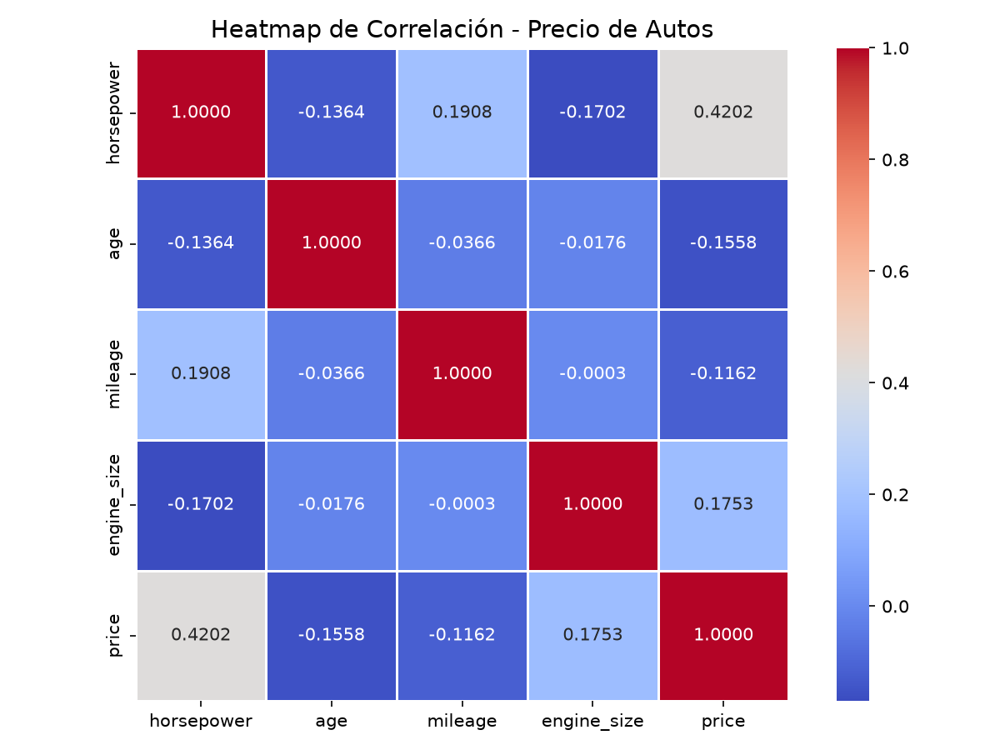
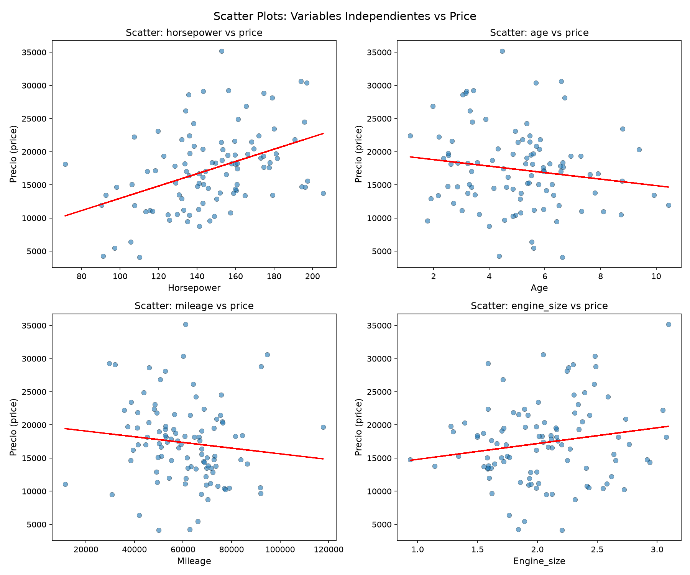
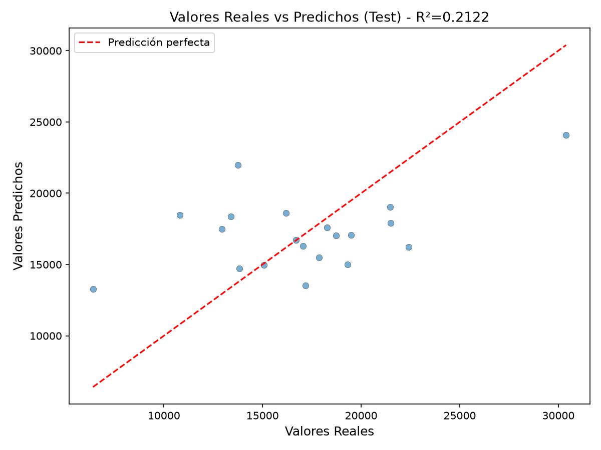
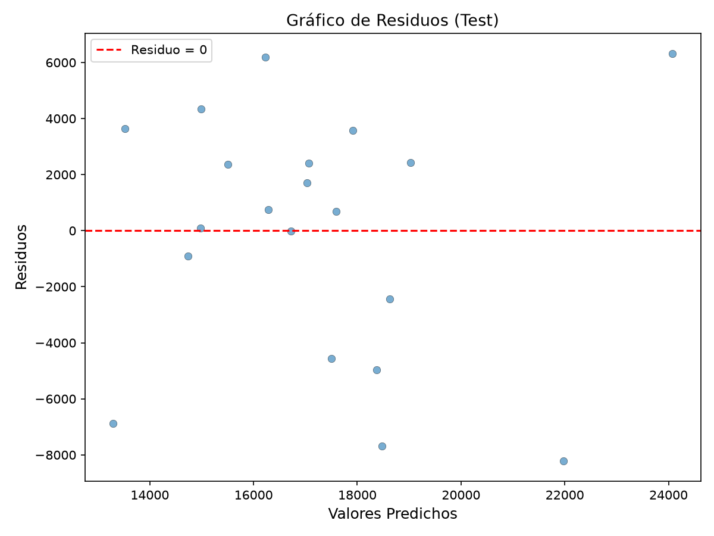

# Laboratorio — Regresión Lineal para Predicción del Precio de Automóviles

## 1. Introducción

El objetivo de este laboratorio es construir un modelo de **regresión lineal múltiple** capaz de estimar el precio de un automóvil (`price`) a partir de cuatro variables independientes: **horsepower**, **age**, **mileage** y **engine_size**. Se utiliza el dataset `automovil_dataset.csv`, que contiene 100 registros sin valores nulos ni duplicados.

---

## 2. Análisis Exploratorio de Datos

El dataset tiene **100 filas y 5 columnas**, todas numéricas. No se encontraron valores nulos ni filas duplicadas.

### Estadísticas descriptivas

| Variable | Media | Desv. Estándar | Mínimo | Máximo |
|---|---|---|---|---|
| horsepower | 146.88 | 27.25 | 71.41 | 205.57 |
| age | 5.04 | 1.91 | 1.16 | 10.44 |
| mileage | 60,973 | 16,264 | 11,381 | 117,791 |
| engine_size | 2.05 | 0.44 | 0.94 | 3.09 |
| price | 17,315 | 6,003 | 4,103 | 35,191 |

---

## 3. Análisis de Correlación

Se calculó la correlación de Pearson entre cada variable independiente y el precio:

| Variable | Correlación con price |
|---|---|
| horsepower | **0.4202** |
| engine_size | 0.1753 |
| mileage | -0.1162 |
| age | -0.1558 |

- **horsepower** y **engine_size** presentan correlación positiva: a mayor potencia y tamaño del motor, mayor precio.
- **age** y **mileage** presentan correlación negativa: autos más viejos y con más kilometraje tienden a valer menos.

### Heatmap de correlación



### Scatter plots: variables independientes vs price



Los gráficos de dispersión confirman visualmente las tendencias detectadas por la correlación. horsepower muestra la relación lineal más clara con el precio.

---

## 4. Modelo de Regresión Lineal Múltiple

Se entrenó un modelo `LinearRegression` de scikit-learn con división **80% entrenamiento / 20% prueba** y `random_state=42`.

### Ecuación del modelo

```
price = 1,283.65 + 110.33×horsepower − 322.76×age − 0.084×mileage + 3,208.21×engine_size
```

### Coeficientes y métricas

| Parámetro | Valor |
|---|---|
| Intercepto (β₀) | 1,283.65 |
| β₁ — horsepower | 110.33 |
| β₂ — age | -322.76 |
| β₃ — mileage | -0.084 |
| β₄ — engine_size | 3,208.21 |

| Métrica | Conjunto | Valor |
|---|---|---|
| R² | Train | 0.3019 |
| R² | Test | 0.2122 |
| MAE | Test | 3,512.11 |
| MSE | Test | 18,542,890.84 |
| RMSE | Test | 4,306.15 |

---

## 5. Evaluación del Modelo

### Valores reales vs predichos



El gráfico muestra los puntos dispersos alrededor de la línea de predicción perfecta. Se observa una tendencia general positiva, aunque con dispersión considerable, lo cual es consistente con el R² de 0.2122.

### Gráfico de residuos



Los residuos se distribuyen alrededor de cero sin un patrón claro de embudo o curvatura, lo que sugiere que no hay una violación grave de homocedasticidad ni no-linealidad evidente. Sin embargo, la dispersión es amplia, reflejando el error del modelo.

---

## 6. Preguntas

### 1. ¿Qué variable corresponde a la variable dependiente y cuáles deberían utilizarse como variables independientes para construir el modelo? Justifique su decisión utilizando evidencia obtenida del análisis de los datos.

**Respuesta:** La variable dependiente es `price`. Las variables independientes son `horsepower`, `age`, `mileage` y `engine_size`. El análisis de correlación justifica esta selección: `horsepower` (0.4202) tiene la correlación más fuerte con el precio, `engine_size` (0.1753) también es positiva, mientras que `age` (-0.1558) y `mileage` (-0.1162) son negativas. Esto es coherente con el mercado: mayor potencia y tamaño de motor aumentan el precio, mientras que mayor antigüedad y kilometraje lo reducen.

### 2. ¿Puede confiarse en el modelo para predecir el precio de nuevos automóviles? Justifique su respuesta utilizando las métricas y el análisis que considere pertinentes.

**Respuesta:** El modelo tiene una confiabilidad limitada. El R² de 0.2122 indica que explica solo el 21.2% de la variabilidad en precios. El RMSE de $4,306 representa aproximadamente el 25% del precio promedio, un margen de error considerable. Aunque no hay un sobreajuste severo (R² train 0.3019 vs test 0.2122), el modelo es útil únicamente como herramienta inicial de estimación, pero no debe ser el único factor en decisiones de compra y venta. Se recomienda complementarlo con inspección física y análisis de mercado.

### 3. Si considera que el modelo es adecuado, estime el precio de un automóvil con las siguientes características: Horsepower = 165 HP; Age = 4 años; Mileage = 58,000 km; Engine Size = 2.0 L. Explique brevemente cómo obtuvo la predicción.

**Respuesta:** Para el automóvil especificado, el precio predicho es **$19,740.79**. Se calculó aplicando la ecuación de regresión:

```
Price = 1,283.65 + 110.33(165) − 322.76(4) − 0.084(58,000) + 3,208.21(2.0)
Price = 1,283.65 + 18,204.49 − 1,291.04 − 4,872.74 + 6,416.43
Price = $19,740.79
```

Considerando el RMSE (±$4,306), el precio real podría oscilar entre aproximadamente $15,434 y $24,046.

---

## 7. Conclusiones

- El modelo de regresión lineal múltiple logra capturar relaciones coherentes con la teoría del mercado automotriz: la potencia y el tamaño del motor influyen positivamente en el precio, mientras que la edad y el kilometraje lo hacen negativamente.
- Sin embargo, el poder predictivo es **bajo** (R² = 0.2122), lo que sugiere que existen otros factores determinantes del precio no incluidos en el modelo: marca, modelo, transmisión, tipo de combustible, estado del vehículo, entre otros.
- Como trabajo futuro, se podría incorporar un conjunto más amplio de variables, probar transformaciones no lineales o utilizar modelos más complejos (árboles de decisión, random forest, etc.) para mejorar la precisión de las predicciones.

---

## Ejecución del código

```bash
pip install -r requirements.txt
python3 regresion_precio_autos.py
```
